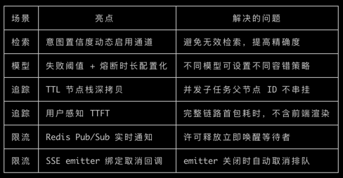
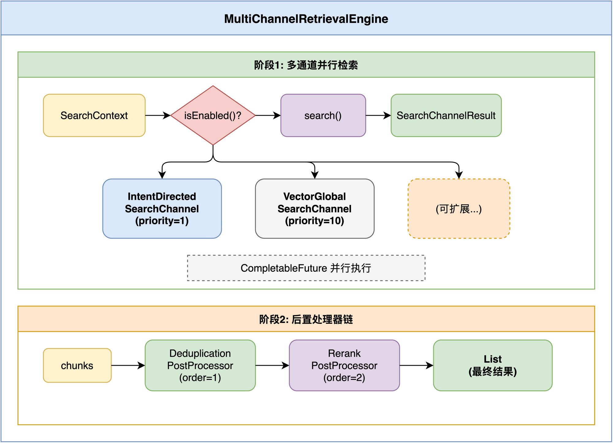
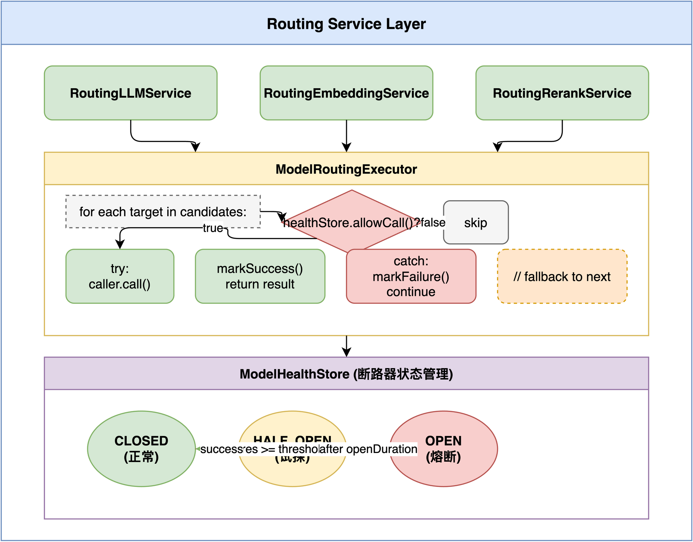
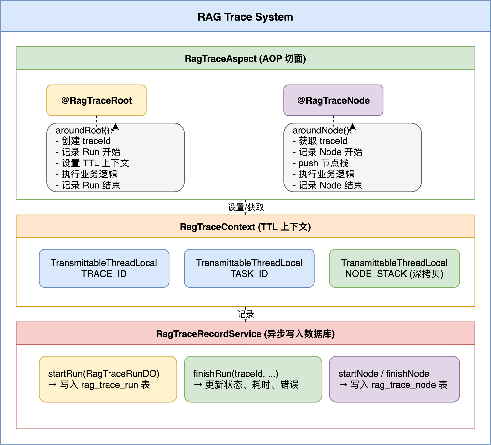
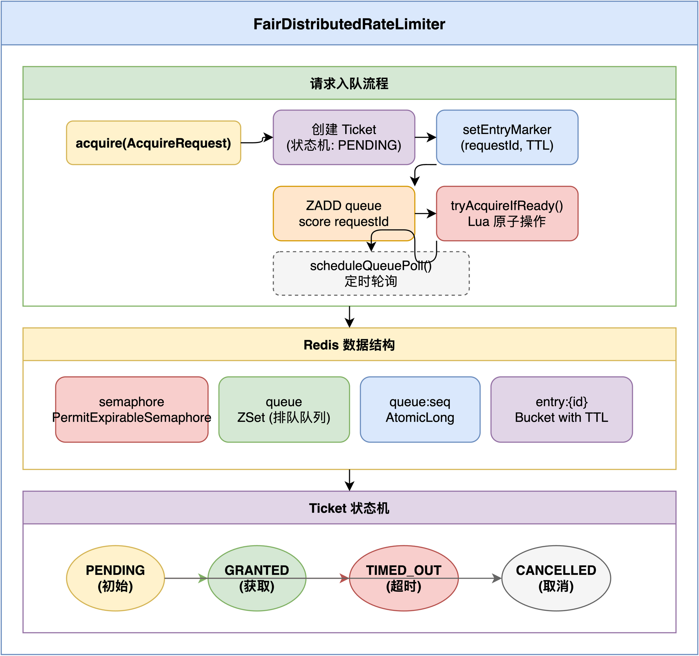

# Tiny Ragent AI

1. 模块化分层清晰
   - framework：通用基础设施，无业务逻辑
   - infra-ai：AI 模型集成层，独立可测试
   - bootstrap：业务实现
2. 配置外部化
   - 所有阈值可配置（熔断、限流、检索）
   - 环境变量注入敏感信息
3. Spotless 代码规范
   - 编译时自动格式化
   - 统一 License Header
4. 向量存储可切换
   - PostgreSQL + pgvector 或 Milvus
   - 配置项 rag.vector.type 切换



## tiny parts

### 已完成瘦身

- ✅ 删除前端项目
- ✅ 删除 MCP 模块
- ✅ 减少模型服务提供商（仅保留硅基流动、阿里云百炼）
- ✅ 向量数据库：移除 pgvector 依赖（仅保留 Milvus）

### 待瘦身步骤

#### 第一阶段：移除非核心功能模块

| 步骤 | 操作 | 影响 | 保留原因 |
|------|------|------|----------|
| 1 | 删除 `admin/` 模块 | Dashboard 相关代码 | 非核心业务，监控可外部化 |
| 2 | 删除 `rag/eval/` 模块 | 评测相关代码 | 仅用于离线评测 |
| 3 | 删除 `ingestion/strategy/fetcher/FeishuFetcher.java` | 飞书文档获取 | 仅保留 LocalFileFetcher |
| 4 | 删除 `ingestion/strategy/fetcher/S3Fetcher.java` | S3 文档获取 | 仅保留 LocalFileFetcher |
| 5 | 删除 `ingestion/strategy/fetcher/HttpUrlFetcher.java` | HTTP URL 获取 | 仅保留 LocalFileFetcher |

#### 第二阶段：简化 Ingestion Pipeline

| 步骤 | 操作 | 说明 |
|------|------|------|
| 6 | 简化 Ingestion 节点 | 仅保留 ParserNode + ChunkerNode + IndexerNode |
| 7 | 删除 EnhancerNode | LLM 增强可由业务层处理 |
| 8 | 删除 EnricherNode | 元数据丰富可由业务层处理 |
| 9 | 删除 `ingestion/prompt/` | 无需 Prompt 模板 |

#### 第三阶段：简化 Knowledge 模块

| 步骤 | 操作 | 说明 |
|------|------|------|
| 10 | 删除 `knowledge/schedule/` | 定时调度可外部触发 |
| 11 | 删除 `knowledge/handler/RemoteFileFetcher.java` | 远程文件获取 |
| 12 | 简化 Chunk 管理接口 | 仅保留核心 CRUD |

#### 第四阶段：简化 Trace 模块

| 步骤 | 操作 | 说明 |
|------|------|------|
| 13 | 删除 Trace 查询接口 | 仅保留写入，查询走日志系统 |
| 14 | 删除 `rag/dao/entity/RagTraceNodeDO.java` 相关查询 | Trace 仅记录到日志 |

#### 第五阶段：简化配置与依赖

| 步骤 | 操作 | 说明 |
|------|------|------|
| 15 | 移除 RocketMQ 依赖 | 改用内存队列或 Redis Stream |
| 16 | 移除 Milvus 依赖 | 仅保留 pgvector |
| 17 | 移除 Tika 部分解析器 | 仅保留 PDF/Markdown 解析 |

### 瘦身后保留的核心亮点

| 亮点 | 说明 |
|------|------|
| 多路并行检索引擎 | SearchChannel 策略模式 + 动态启用 |
| 模型路由与高容错 | 断路器三态机 + 优雅降级 |
| 异步全链路追踪 | @RagTraceRoot/@RagTraceNode + TTL 透传 |
| 分布式公平限流 | ZSet 排队 + Lua 原子操作 |
| 知识库管理 | CRUD + 向量索引 |
| 流式对话 | SSE 推送 + 取消句柄 |

### 瘦身后预估收益

- **代码量减少**：约 30-40%
- **依赖减少**：移除 RocketMQ、Milvus、部分 Tika 解析器
- **启动时间**：减少约 20%
- **维护成本**：聚焦核心能力，减少边缘场景

## core parts

### 多路并行检索引擎架构

> - 策略模式 + 动态启用：根据意图识别结果智能选择检索通道
> - 并行执行：多通道同时检索，显著降低延迟
> - 责任链后置处理：去重 → Rerank 灵活组合
> - 兜底机制：即使意图识别失败，全局检索也能保证有结果

#### 整体架构图



#### 核心组件

##### 1. SearchChannel 接口

定义检索通道的统一契约：

```java
public interface SearchChannel {
    String getName();                    // 通道名称
    int getPriority();                   // 优先级（越小越高）
    boolean isEnabled(SearchContext);    // 动态启用判断
    SearchChannelResult search(SearchContext);  // 执行检索
    SearchChannelType getType();         // 通道类型
}
```

##### 2. 两个核心通道实现

| 通道 | 优先级 | 启用条件 | 检索范围 |
|------|--------|----------|----------|
| **IntentDirectedSearchChannel** | 1 (最高) | 存在 KB 意图且分数 ≥ `minIntentScore` | 意图指定的知识库 |
| **VectorGlobalSearchChannel** | 10 (兜底) | 无意图 / 置信度 < `confidenceThreshold` / 单一中等置信度 | 全部知识库 |

**VectorGlobalSearchChannel 启用逻辑** (`VectorGlobalSearchChannel.java:68-106`)：

```java
boolean isEnabled(SearchContext context) {
    // 1. 意图定向检索关闭时，必须兜底
    if (!intentDirectedEnabled) return true;
    
    // 2. 未识别出任何意图 → 启用
    if (isEmpty(allScores)) return true;
    
    // 3. 最高置信度过低 → 启用
    if (maxScore < confidenceThreshold) return true;
    
    // 4. 单一意图且中等置信度 → 补充检索
    if (allScores.size() == 1 && maxScore < supplementThreshold) return true;
    
    return false;
}
```

##### 3. MultiChannelRetrievalEngine 执行流程

```java
// 阶段1: 并行执行所有启用的通道
List<SearchChannelResult> executeSearchChannels(SearchContext context) {
    // 过滤并排序启用的通道
    List<SearchChannel> enabled = channels.stream()
        .filter(c -> c.isEnabled(context))
        .sorted(Comparator.comparingInt(SearchChannel::getPriority))
        .toList();
    
    // 并行执行
    List<CompletableFuture<SearchChannelResult>> futures = 
        enabled.stream()
            .map(c -> CompletableFuture.supplyAsync(() -> c.search(context), executor))
            .toList();
    
    return futures.stream().map(CompletableFuture::join).toList();
}

// 阶段2: 依次执行后置处理器链
List<RetrievedChunk> executePostProcessors(List<SearchChannelResult> results, SearchContext ctx) {
    List<RetrievedChunk> chunks = results.stream()
        .flatMap(r -> r.getChunks().stream())
        .collect(Collectors.toList());
    
    for (SearchResultPostProcessor processor : enabledProcessors) {
        chunks = processor.process(chunks, results, ctx);
    }
    return chunks;
}
```

##### 4. SearchResultPostProcessor 后置处理器

```java
public interface SearchResultPostProcessor {
    String getName();
    int getOrder();                    // 执行顺序（越小越先）
    boolean isEnabled(SearchContext);
    List<RetrievedChunk> process(List<RetrievedChunk> chunks, 
                                 List<SearchChannelResult> results, 
                                 SearchContext context);
}
```

当前实现：
- **DeduplicationPostProcessor** - 按 chunk ID 去重
- **RerankPostProcessor** - 调用 Rerank 模型重排序

#### 配置项

```yaml
rag:
  search:
    channels:
      vector-global:
        enabled: true
        confidence-threshold: 0.6      # 意图置信度低于此值时启用全局检索
        top-k-multiplier: 3            # 全局检索的 topK 倍数
        single-intent-supplement-threshold: 0.8  # 单一意图补充检索阈值
      intent-directed:
        enabled: true
        min-intent-score: 0.4          # 最小意图分数阈值
        top-k-multiplier: 2            # 意图检索的 topK 倍数
```

#### 设计优势

1. **策略模式** - 每个通道独立实现，易于扩展新的检索策略
2. **动态启用** - 根据上下文智能选择通道，避免无效检索
3. **并行执行** - 多通道同时检索，降低延迟
4. **责任链模式** - 后置处理器链式处理，灵活组合
5. **兜底机制** - 全局检索确保即使意图识别失败也能返回结果

---

### 模型路由与高容错机制

> - 断路器模式：三态机（CLOSED/OPEN/HALF_OPEN）防止级联故障
> - 优雅降级：按优先级依次尝试多个模型候选
> - 自动恢复：无需人工干预，试探请求自动探测恢复
> - 统一抽象：LLM/Embedding/Rerank 三种服务共用路由框架

#### 整体架构图



#### 核心组件

##### 1. ModelRoutingExecutor - 路由执行器

负责在多个模型候选者之间进行调度执行，提供故障转移（Fallback）机制：

```java
public <C, T> T executeWithFallback(
        ModelCapability capability,
        List<ModelTarget> targets,           // 按优先级排序的候选列表
        Function<ModelTarget, C> clientResolver,
        ModelCaller<C, T> caller) {
    
    for (ModelTarget target : targets) {
        // 1. 检查断路器状态
        if (!healthStore.allowCall(target.id())) {
            continue;  // 跳过不可用的模型
        }
        
        try {
            // 2. 执行调用
            T response = caller.call(client, target);
            // 3. 标记成功
            healthStore.markSuccess(target.id());
            return response;
        } catch (Exception e) {
            // 4. 标记失败，尝试下一个
            healthStore.markFailure(target.id());
        }
    }
    
    throw new RemoteException("All model candidates failed");
}
```

##### 2. ModelHealthStore - 断路器状态管理

实现断路器模式，管理每个模型的健康状态：

```java
public class ModelHealthStore {
    
    private enum State {
        CLOSED,      // 正常状态，允许调用
        OPEN,        // 熔断状态，拒绝调用
        HALF_OPEN    // 半开状态，允许一次试探调用
    }
    
    // 判断是否允许调用
    public boolean allowCall(String id) {
        // OPEN 状态且未过期 → 拒绝
        // HALF_OPEN 且已有试探请求 → 拒绝
        // 其他情况 → 允许
    }
    
    // 标记成功：重置为 CLOSED
    public void markSuccess(String id) {
        state = CLOSED;
        consecutiveFailures = 0;
    }
    
    // 标记失败：累加失败次数，可能触发熔断
    public void markFailure(String id) {
        consecutiveFailures++;
        if (consecutiveFailures >= failureThreshold) {
            state = OPEN;
            openUntil = now + openDurationMs;
        }
    }
}
```

**状态转换图：**

```
          failures >= threshold
    CLOSED ─────────────────────→ OPEN
      ↑                              │
      │                              │ after openDuration
      │ success                      │
      └──────────── HALF_OPEN ←──────┘
                        │
                        │ success
                        └────────→ CLOSED
```

##### 3. ModelSelector - 模型选择器

根据配置和健康状态选择可用的模型候选列表：

```java
public class ModelSelector {
    
    // 选择 Chat 模型候选（支持深度思考切换）
    public List<ModelTarget> selectChatCandidates(boolean deepThinking);
    
    // 选择 Embedding 模型候选
    public List<ModelTarget> selectEmbeddingCandidates();
    
    // 选择 Rerank 模型候选
    public List<ModelTarget> selectRerankCandidates();
    
    // 过滤并排序：按优先级排序，排除不可用模型
    private List<ModelTarget> filterAndSortCandidates(...) {
        return candidates.stream()
            .filter(c -> !healthStore.isUnavailable(c.getId()))
            .sorted(Comparator.comparingInt(ModelCandidate::getPriority))
            .map(this::buildModelTarget)
            .toList();
    }
}
```

##### 4. Routing Services - 路由服务实现

三个统一的路由服务实现：

| 服务 | 接口 | 能力类型 | 用途 |
|------|------|----------|------|
| **RoutingLLMService** | LLMService | CHAT | 对话/流式对话 |
| **RoutingEmbeddingService** | EmbeddingService | EMBEDDING | 文本向量化 |
| **RoutingRerankService** | RerankService | RERANK | 检索结果重排 |

```java
// RoutingLLMService 示例
@Override
public String chat(ChatRequest request) {
    return executor.executeWithFallback(
        ModelCapability.CHAT,
        selector.selectChatCandidates(request.getThinking()),
        target -> clientsByProvider.get(target.candidate().getProvider()),
        (client, target) -> client.chat(request, target)
    );
}
```

#### 配置项

```yaml
ai:
  providers:
    bailian:
      url: https://dashscope.aliyuncs.com
      api-key: ${BAILIAN_API_KEY}
    siliconflow:
      url: https://api.siliconflow.cn
      api-key: ${SILICONFLOW_API_KEY}

  selection:
    failure-threshold: 2      # 连续失败次数阈值，触发熔断
    open-duration-ms: 30000   # 熔断器打开持续时间（毫秒）

  chat:
    default-model: qwen3-max
    deep-thinking-model: qwen3-max
    candidates:
      - id: qwen-plus
        provider: bailian
        model: qwen-plus-latest
        priority: 1           # 优先级，越小越优先
      - id: qwen3-max
        provider: bailian
        model: qwen3-max
        supports-thinking: true
        priority: 3
      - id: glm-4.7
        provider: siliconflow
        model: Pro/zai-org/GLM-4.7
        supports-thinking: true
        priority: 4
```

#### 设计优势

1. **高可用性** - 多模型候选，自动故障转移
2. **断路器模式** - 防止级联故障，快速失败
3. **优雅降级** - 按优先级依次降级，保证服务可用
4. **自动恢复** - HALF_OPEN 状态试探恢复，无需人工干预
5. **统一抽象** - LLM/Embedding/Rerank 共用路由机制

### 异步场景的全链路追踪

> - 注解式声明：@RagTraceRoot + @RagTraceNode 零侵入
> - TTL 跨线程传递：阿里巴巴 TTL 自动透传 traceId 到异步线程
> - 节点栈深拷贝：解决并发子任务节点栈串挂问题
> - 树形结构：完整还原调用链路，支持性能分析
> - 流式场景适配：StreamSpan 机制支持 SSE 跨线程 finish

#### 整体架构图



#### 核心组件

##### 1. 注解定义

**@RagTraceRoot** - 标记链路入口（一次完整请求）：

```java
@Target(ElementType.METHOD)
@Retention(RetentionPolicy.RUNTIME)
public @interface RagTraceRoot {
    String name() default "";                    // 链路名称
    String conversationIdArg() default "conversationId";  // 会话ID参数名
    String taskIdArg() default "taskId";         // 任务ID参数名
}
```

**@RagTraceNode** - 标记链路中的子节点：

```java
@Target(ElementType.METHOD)
@Retention(RetentionPolicy.RUNTIME)
public @interface RagTraceNode {
    String name() default "";    // 节点名称（用于展示）
    String type() default "METHOD";  // 节点类型（用于分组统计）
}
```

##### 2. RagTraceContext - TTL 上下文

使用阿里巴巴 TTL（TransmittableThreadLocal）在异步线程池中透传 traceId 与节点栈：

```java
public final class RagTraceContext {
    
    // TTL 透传 traceId，跨线程池传递
    private static final TransmittableThreadLocal<String> TRACE_ID = new TransmittableThreadLocal<>();
    
    // 节点栈：记录当前节点的父节点链
    // 必须深拷贝！否则并发子任务会共用同一个 Deque，导致层级紊乱
    private static final TransmittableThreadLocal<Deque<String>> NODE_STACK = 
        new TransmittableThreadLocal<>() {
            @Override
            public Deque<String> copy(Deque<String> parentValue) {
                return parentValue == null ? null : new ArrayDeque<>(parentValue);
            }
        };
    
    public static void pushNode(String nodeId);   // 进入节点时 push
    public static void popNode();                 // 离开节点时 pop
    public static String currentNodeId();         // 获取当前父节点 ID
    public static int depth();                    // 获取当前深度
}
```

##### 3. RagTraceAspect - AOP 切面

```java
@Aspect
@Component
public class RagTraceAspect {
    
    @Around("@annotation(traceRoot)")
    public Object aroundRoot(ProceedingJoinPoint jp, RagTraceRoot traceRoot) {
        String traceId = IdUtil.getSnowflakeNextIdStr();
        
        // 1. 记录 Run 开始
        traceRecordService.startRun(RagTraceRunDO.builder()
            .traceId(traceId)
            .traceName(traceRoot.name())
            .conversationId(conversationId)
            .status("RUNNING")
            .build());
        
        // 2. 设置 TTL 上下文
        RagTraceContext.setTraceId(traceId);
        try {
            Object result = jp.proceed();
            // 3. 成功收尾
            traceRecordService.finishRun(traceId, "SUCCESS", null, ...);
            return result;
        } catch (Throwable ex) {
            // 4. 异常收尾
            traceRecordService.finishRun(traceId, "ERROR", truncateError(ex), ...);
            throw ex;
        } finally {
            RagTraceContext.clear();
        }
    }
    
    @Around("@annotation(traceNode)")
    public Object aroundNode(ProceedingJoinPoint jp, RagTraceNode traceNode) {
        String nodeId = IdUtil.getSnowflakeNextIdStr();
        String parentNodeId = RagTraceContext.currentNodeId();  // 获取父节点
        int depth = RagTraceContext.depth();                     // 获取深度
        
        traceRecordService.startNode(RagTraceNodeDO.builder()
            .traceId(traceId)
            .nodeId(nodeId)
            .parentNodeId(parentNodeId)
            .depth(depth)
            .build());
        
        RagTraceContext.pushNode(nodeId);  // push 节点栈
        try {
            return jp.proceed();
        } finally {
            RagTraceContext.popNode();     // pop 节点栈
        }
    }
}
```

##### 4. 流式场景特殊处理

流式对话（SSE）场景下，同步部分在调用线程执行，SSE 读循环在异步线程执行。需要跨线程 finish：

```java
public interface RagStreamTraceSupport {
    
    // 在调用线程开启一个 stream 节点
    StreamSpan beginStreamNode(String name, String type);
    
    interface StreamSpan {
        void detach();                    // 调用线程结束时 detach（不 finish）
        void finishSuccess();             // 异步线程 onComplete 时调用
        void finishError(Throwable error); // 异步线程 onError 时调用
        void finishCancelledIfRunning();  // 取消路径
    }
}
```

**StreamChatTraceRunner** - 流式对话 Trace 包装器：

```java
public void run(String question, String conversationId, String taskId,
                StreamCallback callback, Consumer<StreamCallback> businessLogic) {
    
    String traceId = IdUtil.getSnowflakeNextIdStr();
    traceRecordService.startRun(...);
    
    // 包装 callback，在 onFinish 时自动 finishRun
    StreamCallback traceAwareCallback = new ForwardingStreamCallback(callback) {
        @Override
        protected void onFirstContent() {
            recordUserTtft(traceId, ...);  // 记录用户感知首包耗时
        }
        @Override
        protected void onFinish(boolean success, Throwable error) {
            finishRun(traceId, success, error, ...);
        }
    };
    
    RagTraceContext.setTraceId(traceId);
    try {
        businessLogic.accept(traceAwareCallback);
    } finally {
        RagTraceContext.clear();  // 同步阶段结束就清理，避免污染线程池
    }
}
```

#### 生成的 Trace 树结构

```
RagTraceRun (traceId=xxx, traceName="rag-stream-chat")
├── RagTraceNode (nodeId=n1, type="INTENT_RECOGNITION", depth=0)
├── RagTraceNode (nodeId=n2, type="RETRIEVE", depth=0)
│   ├── RagTraceNode (nodeId=n2-1, type="RETRIEVE_CHANNEL", depth=1, parentNodeId=n2)
│   └── RagTraceNode (nodeId=n2-2, type="RERANK", depth=1, parentNodeId=n2)
├── RagTraceNode (nodeId=n3, type="LLM_ROUTING", depth=0)
│   └── RagTraceNode (nodeId=n3-1, type="STREAM", depth=1, parentNodeId=n3)
└── RagTraceNode (nodeId=n4, type="USER_TTFT", depth=0, nodeName="user-first-packet")
```

#### 配置项

```yaml
rag:
  trace:
    enabled: true           # 是否启用追踪
    max-error-length: 1000  # 错误信息最大长度
```

#### 设计优势

1. **注解式声明** - 零侵入，只需在方法上添加注解
2. **TTL 跨线程传递** - 支持异步线程池场景，traceId 自动透传
3. **节点栈深拷贝** - 解决并发子任务节点栈串挂问题
4. **树形结构** - 通过 parentId + depth 构建完整调用树
5. **流式场景支持** - StreamSpan 机制支持跨线程 finish
6. **TTFT 感知** - 记录用户感知首包耗时，反映完整链路前置开销

### 分布式公平排队限流

> - 公平 FIFO 排队：ZSet + 序列号保证顺序
> - Lua 原子操作：队头窗口判断 + 僵尸清理一次完成
> - 僵尸自动清理：entry 标记 TTL 过期，Lua 脚本自动识别清理
> - 状态机幂等：CAS 保证终态互斥，回调最多触发一次
> - 许可自动过期：PermitExpirableSemaphore 防止崩溃后泄漏

#### 整体架构图



#### 核心组件

##### 1. FairDistributedRateLimiter - 公平分布式限流器

基于 Redis 实现的分布式公平排队限流器：

```java
public class FairDistributedRateLimiter {
    
    // Redis Keys
    private final String semaphoreKey;     // 许可信号量
    private final String queueKey;         // 排队队列 (ZSet)
    private final String queueSeqKey;      // 序列号生成器
    private final String notifyTopicKey;   // 通知频道
    private final String entryKeyPrefix;   // 存活标记前缀
    
    // 非阻塞排队抢占
    public void acquire(AcquireRequest req) {
        Ticket ticket = new Ticket(req);
        
        // 1. 写入存活标记 (TTL = 等待预算 + 缓冲)
        setEntryMarker(ticket.requestId, req.maxWaitMillis());
        
        // 2. 入队 (ZSet, score=序列号保证 FIFO)
        queue.add(nextQueueSeq(), ticket.requestId);
        
        // 3. 尝试立即获取
        if (tryAcquireIfReady(ticket)) {
            return;
        }
        
        // 4. 未获取则定时轮询
        scheduleQueuePoll(ticket);
    }
}
```

##### 2. queue_claim_atomic.lua - 原子抢占脚本

Lua 脚本实现原子性的队头窗口判断 + 僵尸清理：

```lua
-- KEYS[1]: 队列 ZSET Key
-- ARGV[1]: 请求 ID
-- ARGV[2]: 最大可进入的 rank（可用许可数）
-- ARGV[3]: entry 存活标记 Key 前缀

local queueKey = KEYS[1]
local requestId = ARGV[1]
local maxRank = tonumber(ARGV[2])
local entryPrefix = ARGV[3]

-- 取头部窗口 + 额外 slack
local slack = 16
local headEntries = redis.call('ZRANGE', queueKey, 0, maxRank + slack - 1)

local liveRank = -1
local liveCount = 0
for i = 1, #headEntries do
    local member = headEntries[i]
    if redis.call('EXISTS', entryPrefix .. member) == 1 then
        if member == requestId then
            liveRank = liveCount
        end
        liveCount = liveCount + 1
    else
        -- 僵尸条目（entry 标记已 TTL 过期），从队列移除
        redis.call('ZREM', queueKey, member)
    end
end

-- 不在存活队头窗口内
if liveRank < 0 or liveRank >= maxRank then return {0} end

-- 出队 claim
local score = redis.call('ZSCORE', queueKey, requestId)
redis.call('ZREM', queueKey, requestId)
redis.call('DEL', entryPrefix .. requestId)

return {1, score}
```

**关键设计点：**
- **僵尸清理**：JVM 崩溃后 entry 标记自然过期，Lua 脚本清理僵尸条目
- **队头窗口**：只有前 `maxRank` 个存活请求才有资格抢占
- **Slack 机制**：额外扫描 16 个条目，处理僵尸密集场景

##### 3. Ticket 状态机

每个请求对应一个 Ticket，通过 CAS 保证终态互斥：

```java
private enum State { PENDING, GRANTED, TIMED_OUT, CANCELLED }

private final class Ticket {
    final AtomicReference<State> state = new AtomicReference<>(State.PENDING);
    final AtomicReference<String> permitRef = new AtomicReference<>();
    
    // 外部取消（emitter 完结/超时/出错）
    void cancel() {
        state.compareAndSet(State.PENDING, State.CANCELLED);
        cleanup();
    }
    
    // 排队超时
    void timeout() {
        if (!state.compareAndSet(State.PENDING, State.TIMED_OUT)) return;
        cleanup();
        req.onTimeout().run();
    }
    
    // 拿到 permit
    boolean grant(String permitId) {
        permitRef.set(permitId);
        if (!state.compareAndSet(State.PENDING, State.GRANTED)) {
            // 已被 cancel/timeout 抢占，释放 permit
            releasePermitQuietly(permitId);
            return false;
        }
        try {
            req.onAcquired().run();
        } finally {
            releaseHeldPermit();  // 业务完成后释放
        }
        return true;
    }
}
```

##### 4. ChatQueueLimiter - 对话排队限流器

封装 `FairDistributedRateLimiter`，处理对话场景的拒绝逻辑：

```java
public void enqueue(String question, String conversationId, 
                    SseEmitter emitter, Runnable onAcquire) {
    
    chatRateLimiter.acquire(AcquireRequest.builder()
        .maxWaitMillis(TimeUnit.SECONDS.toMillis(maxWaitSeconds))
        .onAcquired(onAcquire)
        .onTimeout(() -> handleReject(question, conversationId, emitter))
        .cancelBinder(cancel -> {
            emitter.onCompletion(cancel);
            emitter.onTimeout(cancel);
            emitter.onError(e -> cancel.run());
        })
        .build());
}

// 拒绝处理：记录对话历史 + 发送 SSE 事件
private void handleReject(...) {
    // 1. 记录用户问题 + 拒绝回复到对话历史
    memoryService.append(conversationId, userId, ChatMessage.user(question));
    memoryService.append(conversationId, userId, ChatMessage.assistant("系统繁忙，请稍后再试"));
    
    // 2. 发送 SSE 事件通知前端
    sender.sendEvent("meta", new MetaPayload(conversationId, taskId));
    sender.sendEvent("reject", new MessageDelta(...));
    sender.sendEvent("done", "[DONE]");
}
```

#### Redis 数据结构说明

| Key | 类型 | 用途 |
|-----|------|------|
| `semaphore:semaphore` | PermitExpirableSemaphore | 许可池，支持过期释放 |
| `semaphore:queue` | ZSet | 排队队列，score=入队序列号 |
| `semaphore:queue:seq` | AtomicLong | 序列号生成器 |
| `semaphore:queue:notify` | Topic | 许可变化通知频道 |
| `semaphore:entry:{id}` | Bucket | 请求存活标记，带 TTL |

#### 配置项

```yaml
rag:
  rate-limit:
    global:
      enabled: true              # 是否启用限流
      max-concurrent: 10         # 最大并发数
      max-wait-seconds: 15       # 最大等待时间（秒）
      lease-seconds: 30          # 许可租期（秒）
      poll-interval-ms: 200      # 轮询间隔（毫秒）
```

#### 设计优势

1. **公平排队** - ZSet + 序列号保证 FIFO 顺序
2. **分布式一致** - 基于 Redis，多实例共享限流状态
3. **僵尸自动清理** - entry 标记 TTL + Lua 脚本清理
4. **状态机幂等** - CAS 保证终态互斥，回调最多触发一次
5. **许可自动过期** - PermitExpirableSemaphore 防止泄漏
6. **实时通知** - Redis Pub/Sub 加速唤醒等待者
7. **优雅拒绝** - 超时时记录对话历史，前端收到明确反馈
